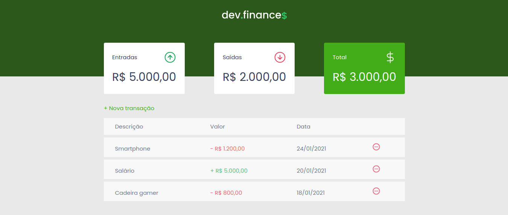

<p align="center" style="margin-top: 50px;">
  </img>
</p>

<p align="center" style="margin: 50px">
  <a href="https://github.com/gcairesdev/dev.finances">
    </img>
  </a>
  <a href="https://github.com/gcairesdev/dev.finances/blob/master/LICENSE.md">
    </img>
  </a>
  <a href="https://github.com/gcairesdev/dev.finances">
    </img>
  </a>
</p>

# Índice

* [Sobre o projeto](#dev-finances)
  * [Feito com](#feito-com)
  * [Objetivo](#objetivo)
  * [Justificativa](#justificativa)
* [Iniciando](#iniciando)
  * [Pré requisitos](#pré-requisitos)
  * [Instalação](#instalação)
* [Contribuindo](#contribuindo)
* [Autor](#autor)
* [Licença](#licença)

## Dev Finances
> Tenha maior controle sobre seus gastos e despesas no Dev.Finance$

Cadastre suas receitas e despesas e tenha um maior controle sobre sua vida financeira.

<p align="center">
    </img>
</p>

## Feito com
* [NextJS](#http://nextjs.org/)
* [ReactJS](#https://reactjs.org/)
* [HTML](#https://www.w3schools.com/html/)
* [CSS](#https://www.w3schools.com/css/)
* [JS](#https://www.w3schools.com/js/)

## Objetivo

O projeto foi contruído para conheçer o NextJS.

## Justificativa
  
Projeto desenvolvido durante a Maratona Discover da @Rocketseat.

## Iniciando

Para iniciar, veja os pré requisitos do projeto.

## Pré requisitos
* [NodeJS 10.13 ou maior](#https://nodejs.org/)
* [MacOS, Windows (com WSL), e Linux são suportados](#)

## Instalação

Clone o repositório:

```git
git clone https://github.com/gcairesdev/dev.finances
```

Entre na pasta do projeto:

```sh
cd dev.finances
```

Instale as dependências:

```sh
npm i
```

Execute o projeto em modo desenvolvimento:

```sh
npm run dev
```

## Autor

Foto | Nome | GitHub | Likedin | E-mail
---- | ---- | ------ | ------- | ------
 | Guilherme Caires | [gcairesdev](https://github.com/gcairesdev) | [Linkedin](https://linkedin.com/in/guilherme-caires/) | contatogcaires@gmail.com

## Contribuindo

Confira a página [CONTRIBUTING](./CONTRIBUTING.md) para ver os melhores locais para arquivar problemas, iniciar discussões e começar a contribuir.

## Licença

Lançado em 2021.
Este projeto está sob a [Licença MIT](./LICENSE.md).

---

<p align="center">
  Feito com :heart: por <a href="https://github.com/gcairesdev">Guilherme Caires</a>
</p>
